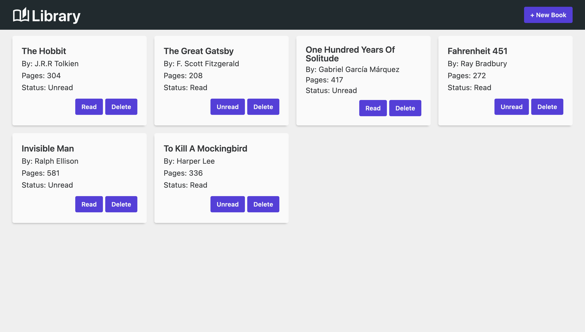

# Library

A simple library app, built with HTML, CSS and JavaScript. 

## Overview

This library app will allow users to collect, update and manage information for books on their reading list.

Users will be able to:
- Add books to their library.
- Update read status of each book.
- Remove books from their library.

### Screenshot

### Links

- [Live Site](https://dasmith963.github.io/library/)